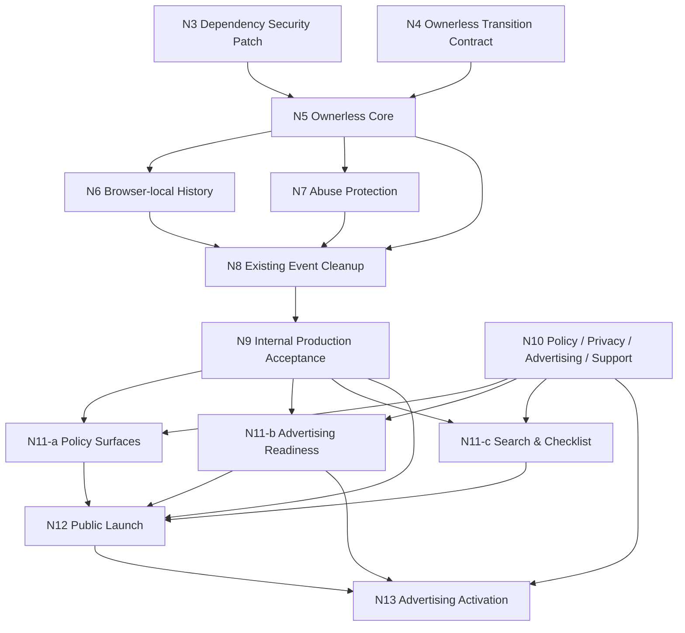

# N2 Launch Roadmap Rebaseline v4（CURRENT ROADMAP）

作成日: 2026-07-17 / 最終改訂: 2026-07-29
ステータス: **Human decision adopted / canonical sync in progress**

## 0. 位置づけ

本v4は旧Roadmap v3と、旧S1-c2b／S1-c3a／S1-c3b／S2-a／S2-bの未完了構造を全面的に置き換えるstandalone版である。本書だけでN3〜N13のGoal、責務、依存関係、launch blocker、Human gate、external-access lifecycleを判断できる。旧Roadmapやchatをcurrent authorityとして併読しない。

- S1-c2a security header baselineはPR #31で`Production accepted`。
- ADR-0009 Ownerless Collaborative Model Decisionは`Accepted`だが、現行application／DBは旧owner modelのまま。ADR-0009の「N3以降: 未確定」「次工程: N2」はN1採用時点のlifecycle snapshotであり、ownerless decision自体を維持したうえで現在のslice状態と次工程は本v4が置き換える。
- N2はHuman decisionを採用済みで、本exact 7文書のmain統合後にcanonicalization完了とする。
- N3〜N13はすべて`PLANNED / NOT IMPLEMENTATION AUTHORIZED`。各sliceは個別Execution ContractとHumanの実装開始承認が必要である。
- N9はownerless applicationの**internal Production acceptance**、N12は唯一の**public-opening gate**、N13は一般公開後の**Advertising Activation**である。
- N13の未完了または広告配信OFFは一般公開のblockerではない。

調整さんのEvent広告構造は[モバイルEventページ広告戦略・実装構造分析](chouseisan-mobile-event-advertising-strategy-and-implementation-analysis-2026-07-29.md)を参考にした。この資料は`SNAPSHOT / HISTORICAL`かつnon-canonical／non-normativeであり、provider採用、広告実装、CSP、Privacy、CMPまたはProduction操作を許可しない。本書の方針はHumanがきめのすけ固有のdecisionとして採用したものである。

## 1. 採用済みbaseline

### 1.1 Ownerless model

- Event作成者は、作成後、有効な共有URLを用いる他の共有利用者と同じ権限を持つ。
- owner URL／token／Cookie／owner-sessionを廃止し、旧owner情報を移行後の認証・認可へ使わない。
- Event accessは`/e/[shareToken]`へ一本化する。
- 「きめること」は作成後不変。「つたえたいこと」は共有利用者が共同編集する。
- Participant、Candidate、Criterion、Vote、Reaction、Concern、CommentとParticipant削除の現行共同編集仕様を維持する。
- 既存Eventと旧owner URLの互換性を維持しない。既存Event cleanupは別Human gateとする。

### 1.2 Browser-local history

- トップの「きめごと」は最新2件、「きめごと一覧」は最大30件を表示する。
- 同一ブラウザ向けの戻り道であり、権限、ownership、認証、認可ではない。
- `localStorage`へ相対share path、title、`lastVisitedAt`、`expiresAt`だけを保存する。
- 180日のsliding expirationとし、有効なEvent作成成功または有効な共有URL再訪で更新する。
- 個別／全削除はEvent本体を削除しない。端末間同期とログイン同期は行わない。

### 1.3 Advertising business model

- Event画面を主要広告面とし、トップページとEvent作成フォームは作成完了率を優先して原則広告を表示しない。
- ローンチ時はEvent主要操作後のin-page広告1枠を安全に置けるprovider非依存境界だけを準備する。
- 実providerの審査、script、publisher ID／slot ID、CMP、Privacy、CSP、ads.txt、Production有効化はN13の独立Human gateとする。
- publisher独自sandbox iframe、bottom overlay、sticky、Auto ads、header bidding、複数provider、2枠目以降は初期採用しない。
- Event title、memo、Candidate、Participant、Vote、Reaction、Concern、Commentを広告targeting parameterとして明示送信しない。
- raw share pathnameをapplication log、analytics event、error report、test artifactへ記録しない。一方、Event親pageで標準広告scriptを動かす将来構成ではproviderがpathnameを技術的に取得し得ることをresidual riskとして扱う。
- Privacy更新と広告activationは同一release gateで扱い、実際の広告有効状態と記載を一致させる。

### 1.4 Search publication

- ローンチ前にpublic pagesのrobots、canonical、sitemapを準備できる。
- Event pagesは一般公開後も`noindex`を維持する。
- public pagesの`noindex`解除、sitemap送信、index requestはN12のHuman public-opening gateで行う。
- Search Console domain propertyの所有権確認はローンチ前に実施可能だが、Google側障害またはDNS反映遅延だけで一般公開を止めない。未完了時はHuman waiverを記録する。

## 2. External-access lifecycle

| 状態 | External access | Vercel Authentication | Data API／WAF | 広告 | 検索 |
|---|---|---|---|---|---|
| 現在〜N7 | 一般公開しない | `All Deployments`を維持 | 現行状態。live変更は各Human gateまで行わない | OFF | 全page `noindex` |
| N8 maintenance | 外部アクセスなし | ON | cleanup／migrationのrunbookに従いData APIをSTOP | OFF | 全page `noindex` |
| N9 internal acceptance | ownerless Productionを内部受入、外部アクセスなし | ON | ownerless Data API再開、Event作成WAF block | OFF | 全page `noindex` |
| N10／N11 | 外部アクセスなしでpolicy・UI・検索準備を実装／QA | ON | N9の受入状態を維持 | provider codeなし、OFF | public page準備のみ |
| N12 preflight／opening | preflight中は外部アクセスなし。Human gate後に一般公開 | preflightはON、N12で初めて解除 | ownerless Data APIとWAF blockを確認 | OFFでも公開可 | public pages index可、Event pages `noindex` |
| N13 activation | 公開を継続 | 解除済み | N12の受入状態を維持 | 承認済み1 provider／1枠をHuman gateでON | N12方針を維持 |

N9完了、N11 deployまたはSearch Console準備はVercel Authentication解除を許可しない。解除はN12の順序付きHuman gateだけで行う。

## 3. Slice一覧

| Slice | 名称 | Goal | 状態 |
|---|---|---|---|
| N3 | Dependency Security Patch | Next.js等の既知dependency riskを、ownerless実装前に最小patchで安定化する | PLANNED / NOT IMPLEMENTATION AUTHORIZED |
| N4 | Ownerless Transition Contract | ownerless DB／RLS／migration／cleanup／share capability／third-party境界を実装前に確定する | PLANNED / NOT IMPLEMENTATION AUTHORIZED |
| N5 | Ownerless Core Implementation | ADR-0009をUI／routing／server／DBへ実装する | PLANNED / NOT IMPLEMENTATION AUTHORIZED |
| N6 | Browser History Implementation | 権限非依存の「きめごと／きめごと一覧」を実装する | PLANNED / NOT IMPLEMENTATION AUTHORIZED |
| N7 | Event Creation Abuse Protection | Event作成rate limitとatomicityを安全に受入する | PLANNED / NOT IMPLEMENTATION AUTHORIZED |
| N8 | Existing Event Cleanup | 旧Event／owner dataの承認済みcleanupとrelease準備を行う | PLANNED / NOT IMPLEMENTATION AUTHORIZED |
| N9 | Ownerless Production Deployment & Internal Acceptance | Authentication下でownerless Productionを受入する | PLANNED / NOT IMPLEMENTATION AUTHORIZED |
| N10 | Launch Policy / Privacy / Advertising / Support | 公開・広告・Privacy・supportのHuman decisionとrunbookを確定する | PLANNED / NOT IMPLEMENTATION AUTHORIZED |
| N11-a | Launch Policy Surfaces | 利用規約、Privacy、affiliate／PR、問い合わせ導線を実装する | PLANNED / NOT IMPLEMENTATION AUTHORIZED |
| N11-b | Event Advertising Readiness | provider codeなしでEvent広告slotとfailure isolationを準備する | PLANNED / NOT IMPLEMENTATION AUTHORIZED |
| N11-c | Search & Launch Checklist | robots／canonical／sitemap／Event noindexとlaunch checklistを準備する | PLANNED / NOT IMPLEMENTATION AUTHORIZED |
| N12 | Public Launch Acceptance | 最終受入後にHumanが一般公開とpublic-page indexingを開始する | PLANNED / NOT IMPLEMENTATION AUTHORIZED |
| N13 | Advertising Activation | provider承認後に1 provider／1枠をProductionで有効化・受入する | PLANNED / NOT IMPLEMENTATION AUTHORIZED |

## 4. Slice責務

### N3 — Dependency Security Patch

既知のhigh severity dependency riskをfresh確認し、ownerless lineへ必要な最小の非major patchだけでhigh findingを解消する。機能変更、ownerless実装、他dependency更新、Production操作を混ぜない。

### N4 — Ownerless Transition Contract

ADR-0009を実装する前に、least-privilege DB／RLS／GRANT／function、owner列・route・Cookie・sessionの撤去、migration順序、旧Event cleanup、rollback、Data API停止／再開、fixtureとProduction gateを確定する。

加えて次をsecurity boundaryとして確定するが、広告実装やprovider採用は行わない。

- third-party広告scriptとshare capabilityの境界
- Event business dataを広告providerへ明示送信しない境界
- raw share pathnameをapplication管理下のlog／analytics／error／test artifactへ記録しない境界
- providerがpathnameを技術的に取得し得るresidual risk
- CSP、Referrer-Policy、kill switchの設計前提
- ownerless security designが将来Event親pageでthird-party広告scriptを実行する構成と両立可能であること

### N5 — Ownerless Core Implementation

- owner URL／token／Cookie／owner-sessionと旧認可fallbackを撤去し、共有URLへ一本化する。
- Event作成成功後は共有URLだけを提示し、owner固有状態を作らない。
- 「きめること」の不変性と作成前確認をUI／server／DBで強制する。
- 「つたえたいこと」を共有共同編集にする。
- Participant等の維持対象とselected participant回帰を守る。
- internal `memo`識別子の維持／変更は、このsliceのExecution Contractで必要性を判断する。

### N6 — Browser History Implementation

§1.2のlocalStorage履歴を実装する。share capabilityの保存を相対pathに限定し、Event business data、Event ID、owner情報を保存しない。storage unavailable／破損／期限切れでもEvent作成・閲覧・編集を阻害しない。selected participant保存とは別責務・別keyとする。

### N7 — Event Creation Abuse Protection

- Event作成専用routeを対象に、WAF ruleを`10分間に5件まで、6件目拒否`として設計する。
- anonymous clientからのdirect Event INSERTを禁止し、Vercel経由の専用server routeとleast-privilege DB経路を使う。broadな`service_role`を既定にしない。
- ローンチ前はcontrolled requestでrule matching、5件成功、6件目拒否、window expiry後の復帰、他route非干渉、Event／Criterion atomicityをfunctional verificationする。
- これは一般利用者の正常traffic観測とは扱わない。
- N12のVercel Authentication解除前にblock状態を確認する。
- 公開後はblockを有効にしたままfalse positiveとshared IP影響を観測し、threshold変更は別Human gateとする。

### N8 — Existing Event Cleanup

N5〜N7の受入後、Vercel Authenticationを維持し、runbookに従ってData APIを停止したmaintenance状態で、Productionの旧Eventとowner dataをfresh discoveryする。Human承認済みexact scopeだけをcleanupし、postcheckとN9 handoff準備を完了する。Production SQLはHuman-onlyとし、artifact生成、ROLLBACK、COMMIT authorization、Human実行、postcheckを分離する。N8ではmigration、application deployment、Data API再開、WAF変更、Production smokeを実行せず、final release Head、migration、runbook、fixture状態を一意にしてN9へ渡す。

### N9 — Ownerless Production Deployment & Internal Acceptance

- Vercel Authenticationを維持したままownerless migration／applicationをProductionへ反映する。
- Data APIをownerless契約で再開し、WAFのcontrolled verificationを行う。
- Production smoke、ownerless権限境界、browser機能、fixture cleanupを完了する。
- 一般access、public-page indexing、Search Console送信を開始しない。
- N9完了後もVercel Authenticationを解除しない。

### N10 — Launch Policy / Privacy / Advertising / Support

- Event画面を主要広告面、トップ／作成フォームを原則非表示面とする。
- 初期provider候補、Cookie／広告識別子、personalized／non-personalized ads、CMP、Privacy Policy、ads.txt、pathname可視性、広告障害時運用、support、affiliate／PR表記を決定する。
- 利用により規約へ同意したものとみなす方式とし、URLを知る人が閲覧・共同編集できること、個人情報・秘密情報を入力しないことを作成画面にも短く表示する。
- 商用／affiliate利用を許容し、経済的利益の明示を求める。spam、欺瞞、権利侵害、malware等を禁止する。
- Event削除依頼は原則受け付けず、個人情報、権利侵害、security等だけを例外判断へ送る。ローンチ前に受信可能な問い合わせ窓口を用意するが、support返信保証は設けない。
- kill switchの操作主体、操作経路、反映目標時間、確認方法を決める。kill switchは有効化後の**新規page load**でprovider scriptと広告requestを止め、既に読み込まれたpageのrequestを遡及取消しする保証はしない。
- provider審査前後のPolicy更新手順を決めるが、provider codeまたはProduction広告配信は開始しない。

### N11-a — Launch Policy Surfaces

利用規約、実際の広告無効状態と一致するPrivacy、affiliate／PR guideline、問い合わせ導線、supportの実効確認を、Vercel Authentication下で実装・QAする。

### N11-b — Event Advertising Readiness

- Event主要操作後に単一広告slotのUI境界を設ける。
- provider非依存とは任意provider向けadapter architectureを作ることではない。単一slot、表示状態、failure isolation、application-side flag／kill-switch境界だけを実装する。
- provider SDK／script、publisher ID／slot ID、provider固有environment／通信、CSP source、CMP、ads.txtを導入しない。
- flag OFF／provider未接続ではcontainer、空白、third-party requestを0にする。
- flag ON相当のcontrolled QAでは規定サイズplaceholderを許可し、unfilled／timeout相当でcollapseする。exact height、timeout、実providerのlayoutはN13で決める。
- fixtureはrepository管理の静的・非商用test fixtureに限定し、外部request、tracking、Cookie、provider codeを含めない。
- mobile／desktopでCandidate、Reaction、Concern、Comment等を覆わず、failureがEvent閲覧・編集を阻害しないことと、activation後のCLS／INP／LCP budgetを確認する。
- N11のQAはapplication-owned boundaryの検証であり、provider iframe、通信、consent、CSP、unfilled、実performance、pathname送信の受入ではない。

### N11-c — Search & Launch Checklist

Codex実装scope:

- public pagesのrobots、canonical、sitemap
- Event pagesの`noindex`維持とtest
- Search Console登録／DNS verification／sitemap送信／index requestのrunbookと対象値
- domain／SSL、backup／recovery、browser／mobile／accessibility、launch checklist

Human gate:

- Search Console property作成
- DNS record追加
- ownership verification

Human操作が必要なownership準備は、runbookと対象値の確定をCodex側DoDとし、実操作の完了を別Human gateで記録する。sitemap送信とindex requestはN11-cで実行せず、N12のpublic-opening Human gateまたはwaiverに限定する。Google側障害またはDNS反映遅延時はHuman waiverでN12へ進める。

### N12 — Public Launch Acceptance

次の順序を固定する。

1. Vercel Authentication下で最終Production acceptanceを行う。
2. Data APIがownerless契約で稼働していることを確認する。
3. Event作成WAF ruleが`10分間に5件まで、6件目拒否`のblock状態であることを確認する。
4. public pagesの`noindex`を解除する。
5. Event pagesの`noindex`維持を再確認する。
6. HumanがVercel Authenticationを解除する。
7. 外部相当browserで閲覧、Event作成、rate limitを確認する。
8. Humanがsitemapを送信するかwaiverを記録する。
9. Humanがindex requestを行うかwaiverを記録する。
10. Humanがlaunchを宣言する。

広告slotとkill-switch境界は完成しているが、広告配信OFF、provider未承認、N13未完了でも一般公開できる。Privacyは実際の広告無効状態と一致させる。

### N13 — Advertising Activation

N13は一般公開後に開始する独立sliceで、一般公開blockerではない。

Gate A — Pre-activation preparation:

- N10のprovider選定を不変前提にせず、provider、契約、申請・承認状態、公式integration、data processing、CMP、CSP、ads.txt要件をfresh確認する。
- provider applicationを開始し、site ownership／reviewに必要な最小artifactを特定する。
- verification code、meta、ads.txtまたはDNS recordが審査に必須の場合だけ、別Human gateで最小artifactを導入できる。この段階では広告配信、tracking、Cookie、広告requestを開始しない。
- site reviewを申請し、approvalを取得する。要件変更または不承認時はN10 decisionをHumanへ戻す。

Gate B — Activation:

- approved providerのad-serving SDK／script、publisher ID／slot ID、必要なCMP、Privacy、CSP、ads.txt、Production environmentを同一release gateで反映する。
- Humanがfeature flagをONにし、mobile／desktop、ad blocker、unfilled／failure fallback、Event操作回帰、pathname可視性、Cookie／consent、CLS／INP／LCP、初期収益を受入する。
- activation失敗時はflagをOFFに維持し、Privacyを実状態へ戻すか、広告開始前でも矛盾しない文面を採用する。Privacy公開だけでactivation完了とは扱わない。

bottom overlay、sticky、Auto ads、header bidding、複数provider、2枠目以降、広告非表示有料planは対象外である。

## 5. 依存関係

N10はN9と並行してdecision／runbook準備を進められるが、N11-a／b／cのapplication／Production変更はN9 internal acceptance後に開始する。

N5〜N7は1つのstacked release lineとして扱い、N9のfinal release Headを固定するまでmainへ個別mergeしない。各PRのReady化はmerge許可ではない。N11-a／b／cをこのrelease lineへ混入させず、N9 internal acceptance後の別lineで扱う。

## 6. Launch blocker／non-blocker

### 一般公開blocker

- N3〜N9のownerless release line accepted
- N10のlaunch時Policy／Privacy／support decision
- N11-a／b／c accepted
- ownerless Data APIの稼働
- Event作成WAF blockの有効化
- public pagesのrobots／canonical／sitemap準備
- Event pagesの`noindex`
- N12の最終Production acceptanceとHuman public-opening gate

### Human waiver可能

- Search Console ownership verification
- sitemap送信
- index request

外部service／DNSの遅延だけを理由に一般公開を停止しない場合は、Humanが未完了内容、risk、後続確認を記録する。

### 一般公開non-blocker

- provider審査・承認
- 実広告配信
- N13 Advertising Activation
- 広告収益発生

## 7. Planned post-launch／deferred

### Planned post-launch

- N13 Advertising Activation
- 公開後WAF false positive／shared IP観測と、必要時のHuman threshold decision

### Deferred／future options

- bottom overlay／sticky広告
- Auto ads
- header bidding
- 複数provider
- 2枠目以降
- 広告非表示有料plan
- analytics／monitoringの新規導入
- Event削除、終了、確定、ロック、共有URL再発行、ban

## 8. 未決定事項

未決定事項は該当sliceのExecution ContractでHumanへ提示し、本書から補完しない。

- N4: exact least-privilege DB contract、migration／rollback／cleanup順序、share capabilityとthird-party境界の実装方式
- N5: internal `memo`識別子を維持するか
- N10: provider候補、CMP／Cookie／personalization、support実施主体、kill switch経路と反映目標
- N11-b／N13: placeholder height、collapse timeout、実providerのperformance budget
- N13: provider審査に必要なverification artifactとactivation要件

N3〜N13の最終Execution Contract、migration分割、Production実行値、Human operation日時は未決定である。

## 9. Authority／execution boundary

- 本書はRoadmapとHuman decisionの正本であり、実装、Git publication、merge、Supabase／Vercel／WAF／DNS／Search Console／広告provider／Production操作のpermissionを生成しない。
- 各sliceは正本確認、Design／Execution Contract、focused review、Human採用、実装開始、Git publication、Production操作を別gateにする。
- Production Supabase write／migration／cleanupはHuman-onlyを維持する。
- Vercel Authentication解除、WAF block変更、DNS／Search Console、provider申請・verification・activation、Privacy公開は対象sliceのHuman gateでだけ行う。
- N2 canonicalizationがmainへ統合されるまで、本書のstatusは`Human decision adopted / canonical sync in progress`とする。統合後はN2を`canonicalized / complete`へ更新できるが、N3開始許可とは扱わない。

## 10. 次のHuman gate

1. exact 7文書のcanonicalization差分をdomain reviewする。
2. Git publicationを別承認する。
3. main統合後、N2をcanonicalized／completeとしてcloseoutする。
4. N3またはN4のどちらを先にContract化するかHumanが判断する。
