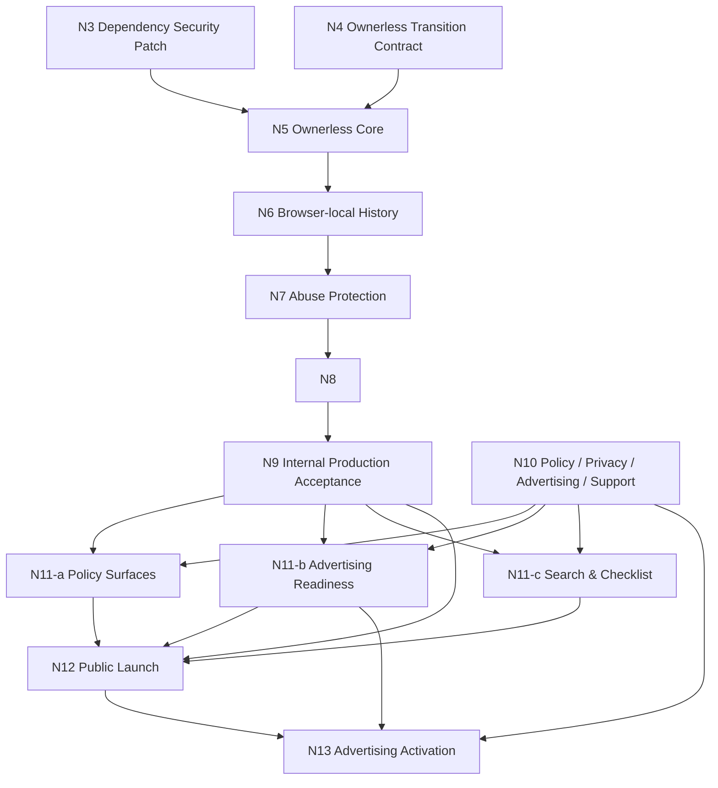

# N2 Launch Roadmap Rebaseline v4（CURRENT ROADMAP）

作成日: 2026-07-17 / 最終改訂: 2026-07-30
ステータス: **N5 H5 ACCEPTED / N6 IMPLEMENTATION HEAD ACCEPTED / N7 v0.4 HUMAN ADOPTED / N7 Plan v0.1 HUMAN ADOPTED / N7 ARCHITECTURE HUMAN ADOPTED / NOT MAIN-INTEGRATED**

## 0. 位置づけ

本v4は旧Roadmap v3と、旧S1-c2b／S1-c3a／S1-c3b／S2-a／S2-bの未完了構造を全面的に置き換えるstandalone版である。本書だけでN3〜N13のGoal、責務、依存関係、launch blocker、Human gate、external-access lifecycleを判断できる。旧Roadmapやchatをcurrent authorityとして併読しない。

- S1-c2a security header baselineはPR #31で`Production accepted`。
- ADR-0009 Ownerless Collaborative Model Decisionは`Accepted`だが、現行application／DBは旧owner modelのまま。ADR-0009の「N3以降: 未確定」「次工程: N2」はN1採用時点のlifecycle snapshotであり、ownerless decision自体を維持したうえで現在のslice状態と次工程は本v4が置き換える。
- N2はHuman decisionを採用済みで、exact 7文書をPR #34（Head `e6429d1de2cb15ce3821ae04e443b4a0be8a9e83`、merge `ef84dcd0e63b709ba566c6330e1da6fff11e81a6`）によりmainへ統合し、canonicalization lifecycleを完了した。この`CLOSED`はtask branch／worktree／remote branchのGit closeout完了を意味しない。
- N3は`CONTRACT ADOPTED / MODE B / NOT IMPLEMENTATION AUTHORIZED`、N4は`ADOPTED / NOT IMPLEMENTATION AUTHORIZED`である。N5は`TASK-BRANCH CANDIDATE / LAYER 2 COMPLETE / H5 ACCEPTED / NOT MAIN-INTEGRATED`である。N6 Handoffは完了し、Execution Contract／PlanはHuman採用済み、implementation PR #41のHead `cfdc5178f73c34a535f16054dbedd6f53e722869`は`HEAD ACCEPTED / NOT MAIN-INTEGRATED`で、N7 baseである。N7 Handoff v0.3は`HUMAN ADOPTED / IMMUTABLE PROVENANCE`、Execution Contract v0.4は`HUMAN ADOPTED / CURRENT AUTHORITY`、v0.3は`SUPERSEDED AS CURRENT AUTHORITY / RETAINED AS IMMUTABLE HISTORICAL HUMAN-ADOPTED ARTIFACT`、v0.2は同じくhistorical artifactである。N7 Implementation Plan v0.1はIndependent Review `PASS`を経た`HUMAN ADOPTED / CURRENT IMPLEMENTATION PLAN AUTHORITY`であり、body内の`DRAFT / NOT ADOPTED / NOT IMPLEMENTATION AUTHORIZED`はimmutable snapshotとして保持する。N7 Architectureは`VERCEL-ALIGNED ROUTE-SPECIFIC OPERATIONAL ABUSE MITIGATION / HUMAN ADOPTED / CURRENT N7 ARCHITECTURE`である。N8〜N13は`PLANNED / NOT IMPLEMENTATION AUTHORIZED`である。各decisionまたはacceptanceからClass M packet design、追加実装、Git publication、merge、Production／Supabase／Vercel操作のpermissionを導出しない。
- 有効なmain baseline `87295a19f80192ffbe91c56dded86748d3a51bbd`のapplication／DBは旧owner modelであり、ownerlessはN5 task branch上の実装候補である。QA resource `where-to-visit-qa`（ref `twcbycyyrxbovtgiqaun`）の作成は`COMPLETE_BY_HUMAN`、creation record reviewは`APPROVED_BY_HUMAN`（SHA-256 `cca7c110c7152574c689ac10d01a4e4c85e105d7f3331755982bfbc741569f76`）である。Layer 2とH5はaccepted Head `022b85776109bae62ef21380539523bafc3e147b`へ固定し、N6 handoffは別branchで管理する。main統合はHuman merge待ちとする。
- N9はownerless applicationの**internal Production acceptance**、N12は唯一の**public-opening gate**、N13は一般公開後の**Advertising Activation**である。
- N13の未完了または広告配信OFFは一般公開のblockerではない。

調整さんのEvent広告構造は[モバイルEventページ広告戦略・実装構造分析](chouseisan-mobile-event-advertising-strategy-and-implementation-analysis-2026-07-29.md)を参考にした。この資料は`SNAPSHOT / HISTORICAL`かつnon-canonical／non-normativeであり、provider採用、広告実装、CSP、Privacy、CMPまたはProduction操作を許可しない。本書の方針はHumanがきめのすけ固有のdecisionとして採用したものである。

## 1. 採用済みbaseline

### 1.1 Ownerless model

- Event作成者は、作成後、有効な共有URLを用いる他の共有利用者と同じ権限を持つ。
- owner URL／token／Cookie／owner-sessionを廃止し、旧owner情報を移行後の認証・認可へ使わない。
- Event accessは`/e/[shareToken]`へ一本化する。
- 「きめること」は作成後不変。「つたえたいこと」は共有利用者が共同編集する。
- Participant、Candidate、Criterion、Vote、Reaction、Concern、CommentとParticipant削除の現行共同編集仕様を維持する。
- 既存Eventと旧owner URLの互換性を維持しない。既存Event cleanupは別Human gateとする。

### 1.2 Browser-local history

- トップの「きめごと」は最新2件、「きめごと一覧」は最大30件を表示する。
- 同一ブラウザ向けの戻り道であり、権限、ownership、認証、認可ではない。
- `localStorage`へ同一originのcanonical relative pathname `^/e/[A-Za-z0-9_-]{43}$`、title、`lastVisitedAt`、`expiresAt`だけを保存する。pathnameはEvent access capabilityを含むlocatorであり、raw share token単体／派生識別子／full URL／query／fragmentとして保存・外部転記しない。
- 180日のsliding expirationとし、有効なEvent作成成功または有効な共有URL再訪で更新する。
- 個別／全削除はEvent本体を削除しない。端末間同期とログイン同期は行わない。

### 1.3 Advertising business model

- Event画面を主要広告面とし、トップページとEvent作成フォームは作成完了率を優先して原則広告を表示しない。
- ローンチ時はEvent主要操作後のin-page広告1枠を安全に置けるprovider非依存境界だけを準備する。
- 実providerの審査、script、publisher ID／slot ID、CMP、Privacy、CSP、ads.txt、Production有効化はN13の独立Human gateとする。
- publisher独自sandbox iframe、bottom overlay、sticky、Auto ads、header bidding、複数provider、2枠目以降は初期採用しない。
- Event title、memo、Candidate、Participant、Vote、Reaction、Concern、Commentを広告targeting parameterとして明示送信しない。
- raw share pathnameをapplication log、analytics event、error report、test artifactへ記録しない。一方、Event親pageで標準広告scriptを動かす将来構成ではproviderがpathnameを技術的に取得し得ることをresidual riskとして扱う。
- Privacy更新と広告activationは同一release gateで扱い、実際の広告有効状態と記載を一致させる。

### 1.4 Search publication

- ローンチ前にpublic pagesのrobots、canonical、sitemapを準備できる。
- Event pagesは一般公開後も`noindex`を維持する。
- public pagesの`noindex`解除、sitemap送信、index requestはN12のHuman public-opening gateで行う。
- Search Console domain propertyの所有権確認はローンチ前に実施可能だが、Google側障害またはDNS反映遅延だけで一般公開を止めない。未完了時はHuman waiverを記録する。

## 2. External-access lifecycle

| 状態 | External access | Vercel Authentication | Data API／WAF | 広告 | 検索 |
|---|---|---|---|---|---|
| 現在〜N7 | 一般公開しない | `All Deployments`を維持 | 現行状態。live変更は各Human gateまで行わない | OFF | 全page `noindex` |
| N8 maintenance | 外部アクセスなし | ON | cleanup／migrationのrunbookに従いData APIをSTOP | OFF | 全page `noindex` |
| N9 internal acceptance | ownerless Productionを内部受入、外部アクセスなし | ON | ownerless Data API再開、Event作成WAF block | OFF | 全page `noindex` |
| N10／N11 | 外部アクセスなしでpolicy・UI・検索準備を実装／QA | ON | N9の受入状態を維持 | provider codeなし、OFF | public page準備のみ |
| N12 preflight／opening | preflight中は外部アクセスなし。Human gate後に一般公開 | preflightはON、N12で初めて解除 | ownerless Data APIとWAF blockを確認 | OFFでも公開可 | public pages index可、Event pages `noindex` |
| N13 activation | 公開を継続 | 解除済み | N12の受入状態を維持 | 承認済み1 provider／1枠をHuman gateでON | N12方針を維持 |

N9完了、N11 deployまたはSearch Console準備はVercel Authentication解除を許可しない。解除はN12の順序付きHuman gateだけで行う。

## 3. Slice一覧

| Slice | 名称 | Goal | 状態 |
|---|---|---|---|
| N3 | Dependency Security Patch | Next.js等の既知dependency riskを、ownerless実装前に最小patchで安定化する | CONTRACT ADOPTED / MODE B / NOT IMPLEMENTATION AUTHORIZED |
| N4 | Ownerless Transition Contract | ownerless DB／RLS／migration／cleanup／share capability／third-party境界を実装前に確定する | ADOPTED / NOT IMPLEMENTATION AUTHORIZED |
| N5 | Ownerless Core Implementation | ADR-0009をUI／routing／server／DBへ実装する | IMPLEMENTATION START AUTHORIZED / TASK-BRANCH CANDIDATE / LAYER 2 COMPLETE / H5 ACCEPTED / N6 HANDOFF READY / NOT MAIN-INTEGRATED |
| N6 | Browser History Implementation | 権限非依存の「きめごと／きめごと一覧」を実装する | IMPLEMENTATION HEAD ACCEPTED / PR #41 / NOT MAIN-INTEGRATED |
| N7 | Event Creation Abuse Protection | exact Event作成routeのoperational abuse mitigationとatomicityを安全に受入する | v0.4 HUMAN ADOPTED / PLAN v0.1 HUMAN ADOPTED / IMPLEMENTATION CANDIDATE COMPLETE / C1 PASS / FOCUSED REVIEW PASS / ARCHITECTURE HUMAN ADOPTED / CLASS M packet v0.1 SHA `93d2252ab4e1bc452e8c86ae100520a54782434ca7af8df88e2fb5c76eaabf18` HUMAN ADOPTED / CURRENT N7 CLASS M OPERATION PACKET AUTHORITY / Independent Review PASS / Option A selected / CANDIDATE FREEZE AND PUBLICATION NOT AUTHORIZED / FURTHER IMPLEMENTATION NOT AUTHORIZED / next `N7_CANDIDATE_FREEZE_AND_PREVIEW_SOURCE_PUBLICATION_PACKET_AUTHORIZATION` |
| N8 | Existing Event Cleanup | 旧Event／owner dataの承認済みcleanupとrelease準備を行う | PLANNED / NOT IMPLEMENTATION AUTHORIZED |
| N9 | Ownerless Production Deployment & Internal Acceptance | Authentication下でownerless Productionを受入する | PLANNED / NOT IMPLEMENTATION AUTHORIZED |
| N10 | Launch Policy / Privacy / Advertising / Support | 公開・広告・Privacy・supportのHuman decisionとrunbookを確定する | PLANNED / NOT IMPLEMENTATION AUTHORIZED |
| N11-a | Launch Policy Surfaces | 利用規約、Privacy、affiliate／PR、問い合わせ導線を実装する | PLANNED / NOT IMPLEMENTATION AUTHORIZED |
| N11-b | Event Advertising Readiness | provider codeなしでEvent広告slotとfailure isolationを準備する | PLANNED / NOT IMPLEMENTATION AUTHORIZED |
| N11-c | Search & Launch Checklist | robots／canonical／sitemap／Event noindexとlaunch checklistを準備する | PLANNED / NOT IMPLEMENTATION AUTHORIZED |
| N12 | Public Launch Acceptance | 最終受入後にHumanが一般公開とpublic-page indexingを開始する | PLANNED / NOT IMPLEMENTATION AUTHORIZED |
| N13 | Advertising Activation | provider承認後に1 provider／1枠をProductionで有効化・受入する | PLANNED / NOT IMPLEMENTATION AUTHORIZED |

## 4. Slice責務

### N3 — Dependency Security Patch

既知のhigh severity dependency riskをfresh確認し、ownerless lineへ必要な最小の非major patchだけでhigh findingを解消する。機能変更、ownerless実装、他dependency更新、Production操作を混ぜない。

`WTV-N3-DEPENDENCY-SECURITY-PATCH v0.3-draft`はMode BとしてHuman採用済みである。Contract §12のcurrent evidenceはauthoritative Human exact messageであり、corrected record `WTV-N3-v0.3-CORRECTED-HUMAN-ADOPTION-AND-RISK-ACCEPTANCE-01`のrepository retained copyはSHA-256 [`ca97f14aa5109023e6e4ee442f2e73c71feda09223cb293ba945a74c916925ee`](../contracts/WTV-N3-DEPENDENCY-SECURITY-PATCH-v0.3-corrected-human-adoption-and-risk-acceptance-record.md)である。risk ownerは`kcyth39`、`acceptedAt`は`2026-07-29 20:53 JST`、risk acceptanceの期限は`2026-08-28 23:59:00 JST`で、4 advisoryを対象とする。PostCSSは`REACHABLE（build-time／repo-controlled input only）`、sharpは`UNKNOWN（conditional runtime path present／actual invocation unverified）`であるため、Contract §15の`Unknown reachability 0`とlocal DoDは未達で、executionは`N3_MODE_B_LOCAL_EXECUTION_PACKET_BLOCKED`である。overrideは未採用、High 0は未主張、local-only spike、dependency変更、install、local DB-dependent QA、Git publication、Preview／Production操作は未許可である。次gateはevidence-onlyの`N3_SHARP_REACHABILITY_RESOLUTION`とし、risk acceptanceまたはgate名からreachability調査その他のexecution permissionを導出しない。期限切れまたはadvisory／package stateのdrift時は再確認する。

### N4 — Ownerless Transition Contract

ADR-0009を実装する前に、least-privilege DB／RLS／GRANT／function、owner列・route・Cookie・sessionの撤去、migration順序、旧Event cleanup、rollback、Data API停止／再開、fixtureとProduction gateを確定する。

`WTV-N4-OWNERLESS-TRANSITION-CONTRACT v0.7-rebaselined-draft`はHuman採用済みであり、その採用自体はN5実装を許可しなかった。dedicated non-Production QA project方式、dedicated least-privilege Postgres role方式（candidate `kimenosuke_event_creator`）、内部識別子`memo`の維持、normalized memo最大1000文字を採用した。後続のN5 entry decisionsとimplementation startはそれぞれ別Human gateで承認済みであり、current lifecycleと具体的なdecisionは次節および[Entry Decision Contract](../contracts/WTV-N5-ENTRY-DECISION-CONTRACT-v0.1-draft.md)を正とする。QA project resource、hosted Event creator credential、minimum-privilege probe、Preview REST target binding、M01〜M11 replayはLayer 2で完了し、raw credentialは記録しない。

加えて次をsecurity boundaryとして確定するが、広告実装やprovider採用は行わない。

- third-party広告scriptとshare capabilityの境界
- Event business dataを広告providerへ明示送信しない境界
- raw share pathnameをapplication管理下のlog／analytics／error／test artifactへ記録しない境界
- providerがpathnameを技術的に取得し得るresidual risk
- CSP、Referrer-Policy、kill switchの設計前提
- ownerless security designが将来Event親pageでthird-party広告scriptを実行する構成と両立可能であること

### N5 — Ownerless Core Implementation

- Lifecycleは`IMPLEMENTATION START AUTHORIZED / TASK-BRANCH CANDIDATE / LAYER 2 COMPLETE / H5 ACCEPTED / N6 HANDOFF READY / NOT MAIN-INTEGRATED`である。H5 accepted Headは`022b85776109bae62ef21380539523bafc3e147b`で固定し、N5 PR #39へ追加commitを積まない。
- current main baselineは旧owner model、targetはADR-0009のownerless modelであり、task branch上の実装をmain実装済みまたは受入済みと扱わない。
- owner URL／token／Cookie／owner-sessionと旧認可fallbackを撤去し、共有URLへ一本化する。
- Event作成成功後は共有URLだけを提示し、owner固有状態を作らない。
- 「きめること」の不変性と作成前確認をUI／server／DBで強制する。
- 「つたえたいこと」を共有共同編集にする。
- Participant等の維持対象とselected participant回帰を守る。
- internal `memo`識別子を維持し、LF normalization、ECMAScript trim、Unicode scalar value count最大1000、unpaired surrogate拒否、DB `char_length` parityをUI／server／DBで強制する。

Human採用済みentry decisionsは次のとおりである。

- D1: dedicated non-Production QA project方式。resource `where-to-visit-qa`（ref `twcbycyyrxbovtgiqaun`）はHuman作成済みで`COMPLETE_BY_HUMAN`
- Creation record: Human review `APPROVED_BY_HUMAN`、SHA-256 `cca7c110c7152574c689ac10d01a4e4c85e105d7f3331755982bfbc741569f76`
- Canonical docs synchronization: 本PRでbranch上のcurrent statusを同期し、main統合はHuman merge待ち
- D2: `N5_LAYER2_SQL_EDITOR_CLEAN_CHAIN_V1`。M01〜M11のimmutable migration exact 11件をreplayし、M12は作成していない
- D3: `pg@8.22.0`／`@types/pg@8.20.0`。N5 dependency installはtask branchで`PASS`、main未統合
- D4: server-only `KIMENOSUKE_EVENT_CREATOR_DATABASE_URL`／`KIMENOSUKE_EVENT_CREATOR_DATABASE_CA_PEM`。hosted Event creator credentialは`PRESENT / VERIFIED`で、raw値は記録しない。対象branchのPreview REST target bindingは`PASS`
- D5: Node.js 24、short-lived `pg.Client`、Shared Supavisor transaction port `6543`、`connectionTimeoutMillis=5000`、`lock_timeout=1000`、`statement_timeout=5000`、`query_timeout=7000`、`idle_in_transaction_session_timeout=5000`、`application_name=kimenosuke-event-creator`、`client_encoding=UTF8`、verify-full相当、prepared statement 0、retry 0、timeout／切断後`OUTCOME_UNKNOWN`。Layer 2 connection／Preview basic-function QAは`PASS`
- D6: Human-only local credential provisioning lifecycle。QA projectのdedicated role／grant minimum-privilege probeは`PASS`し、raw password／credentialは記録しない
- D7: LF normalization、ECMAScript trim、Unicode scalar value count最大1000。ownerless candidateへ反映し、full CRUD coverageは主張しない
- Error copy: `つたえたいことは1000文字までです。`。採用済みruleとしてLayer 2 QAへ同期

Approved external creation recordはQA resource identity authorityを維持する。本Layer 2 acceptanceは、migration exact 11件、M01〜M11 immutable、M12 absent、credential／minimum privilege、Preview REST binding、basic-function QA、fixture cleanupを含む。Vercel Runtime Logsだけではoutbound REST hostを直接証明できないため、branch-specific override、deployment identity、QA-only Event表示／共同編集、postflightの複合証拠をHumanが受容し、evidence limitationを非blockingとして記録する。full CRUD coverageは主張しない。same-SHA `H5` acceptanceは完了し、N6 handoffは別branchへ固定する。N5単独をmainへmergeせず、N3のdependency security、N7のWAF／rate limit、N8の既存Event cleanupをN5へ混入させない。N5では8 business tableのrow 0をfail-closed preconditionとして観測するだけで既存dataを変換・削除しない。

### N6 — Browser History Implementation

N6 Handoffは完了し、Execution Contract／PlanはHuman採用済みである。implementation PR #41のHead `cfdc5178f73c34a535f16054dbedd6f53e722869`はHuman acceptedで、lifecycleは`IMPLEMENTATION HEAD ACCEPTED / NOT MAIN-INTEGRATED`である。このHeadをN7 future baseとする。PR #41のReady状態またはHead acceptanceから個別main merge、追加N6実装／publication、N7 execution、Production／Supabase／Vercel操作のpermissionを導出しない。

§1.2のlocalStorage履歴を実装する。保存locatorはcanonical relative pathname `^/e/[A-Za-z0-9_-]{43}$`だけであり、capability-bearing pathnameをraw token単体／派生識別子／full URL／query／fragmentとして保存・外部転記しない。localStorageはclient-onlyでSSR／hydrationを阻害せず、storage unavailable／破損／期限切れでもEvent作成・閲覧・編集を阻害しない。同一pathname upsert、180日sliding、latest 2／max 30、purge、selected participant保存との別責務をN6 Execution Contractで具体化する。

### N7 — Event Creation Abuse Protection

- N7をglobal exact quotaではなく、exact `POST /api/events`に対するVercel-aligned route-specific operational abuse mitigationとして扱う。
- launch-time provisional parameterはIP単位、fixed window 600秒、60 requests、超過時HTTP 429とする。Vercelのregion-scoped counterに沿うHuman-adjustableな運用値であり、個人単位の利用権、global exact guaranteeまたは永久不変のproduct invariantではない。
- 学校、会社、イベント会場、公共Wi-Fi、家庭、NAT gateway等のshared IPを考慮し、正規の一斉利用を不必要に遮断せず、明らかなsingle-source burstを抑える初期guardrailとする。
- anonymous clientからのdirect Event INSERTを禁止し、Vercel経由の専用server routeとleast-privilege DB経路を使う。broadな`service_role`を既定にしない。
- 429はbody parse前に分類してbodyを信頼・表示せず、draftを保持し、navigation、automatic retry、N6 history mutationを0とする。rejected Event／default Criterion row deltaを0、accepted Event＋default Criterionをatomicに保つ。
- Class Rではregional counter等のprovider conflictを確認済みだが、Preview isolation、pre-route／pre-DB rejection、Hosted 429、raw-IP-free proof、cleanupは未証明であり、PASSへ推測しない。
- old `GLOBAL EXACT 5／600 OPTION D`は`REJECTED / HISTORICAL / NOT FEASIBLE ON VERCEL FIREWALL ALONE`、new `VERCEL-ALIGNED ROUTE-SPECIFIC OPERATIONAL ABUSE MITIGATION`は`HUMAN ADOPTED / CURRENT N7 ARCHITECTURE`である。
- HumanはClass M packet reviewとpacket adoption、N7 implementation candidate、C1、focused implementation review、QA DB PF-1〜PF-6、active Preview Firewall rule reconciliationおよびN5〜N9 closeout guideを完了した。current lifecycleは`IMPLEMENTATION CANDIDATE COMPLETE / C1 PASS / FOCUSED REVIEW PASS / CANDIDATE FREEZE AND PUBLICATION NOT AUTHORIZED`であり、further implementationは`NOT AUTHORIZED`である。N7 candidate freeze、stage／commit／push、remote N7 branch、branch-specific QA binding、qualified Preview、Hosted QA、fixture cleanup、final N7 Head acceptance、stacked PRおよびN8は未完了または未許可である。current next actionは`N7_CANDIDATE_FREEZE_AND_PREVIEW_SOURCE_PUBLICATION_PACKET_AUTHORIZATION`であり、このlifecycle correctionからpublication permissionを導出しない。以後のHuman判断には、candidate publicationに加え、token necessity確認、Project scope確認、expiry／fresh validity確認、credential safety preflight確認、exact Project-first Class R authorization、Class R result review、M1 authorization、M1 result review、M2 authorization、M2 result review、Hosted QA authorization、Hosted QA result review、Retain／Remove decision、fixture-cleanup authorization、fixture-cleanup result review、Remove時のM3 authorization、M3 result review、M4 authorization、final active read-back review、token retention／revoke decision、Production separate decisionがある。前工程完了から次permissionを自動導出しない。Class M packet v0.1は[`WTV-N7-EVENT-CREATION-ABUSE-PROTECTION-CLASS-M-OPERATION-PACKET-v0.1-draft.md`](../operations/WTV-N7-EVENT-CREATION-ABUSE-PROTECTION-CLASS-M-OPERATION-PACKET-v0.1-draft.md)として、final SHA-256 `93d2252ab4e1bc452e8c86ae100520a54782434ca7af8df88e2fb5c76eaabf18`、`HUMAN ADOPTED / CURRENT N7 CLASS M OPERATION PACKET AUTHORITY`、Independent Review `N7_CLASS_M_PACKET_INDEPENDENT_REVIEW_PASS_READY_FOR_HUMAN_ADOPTION`（P0／P1／P2／P3すべて`0`）、Human adoption gate `N7_CLASS_M_PACKET_HUMAN_ADOPTION`／`ADOPT`である。Packet本文の`DRAFT / NOT ADOPTED / NOT CLASS M AUTHORIZED / NOT EXECUTION AUTHORIZED`とreview pendingはimmutable reviewed-body snapshotとして保持する。technical design authorization `N7_CLASS_M_PACKET_DESIGN_AUTHORIZATION`、artifact drafting authorization `N7_CLASS_M_PACKET_ARTIFACT_DRAFT_AUTHORIZATION`、focused correction authorization `N7_CLASS_M_PACKET_SINGLE_WRITER_FOCUSED_CORRECTION_AUTHORIZATION`はprovenanceである。packet adoptionからcredential access、Class R、M1〜M4、Hosted QA、fixture creation、DB postcheck、fixture cleanup、Retain／Remove operation、Productionのpermissionを導出しない。Bot Protection、JA4、additional WAF condition、application-side limiter等は自動採用しない。

- project-scoped Vercel tokenは存在し、selected Projectは`where-to-visit-kimenosuke`、exact Project readは`PASS`である。tokenは技術的にwrite-capableであり得る。Humanはpre-launch development中の保持を許可するが、保持からAPI use permissionを導出しない。将来のexternal taskごとにtoken necessity、exact scope／target、expiry／fresh validity、credential safety preflight、exact operation authorization、exact START、mutation upper bound、post-operation retention／revoke reviewを確認し、token value、prefix、hash、length、secret expiry、credential path contentは記録しない。

N7 Handoff／Entry Contract v0.3（SHA-256 `3b5c3de4644088f74a0d01dd4d00c9ca7931107e1d226d2869d007b7ebf5b166`）は`HUMAN ADOPTED / IMMUTABLE PROVENANCE / N7 ENTRY BOUNDARY`であり、current Execution Contract authorityではない。Execution Contract v0.4（SHA-256 `e694757d947126375c1da07ab3f4e4f5a79f61220545aae003bc68f9153a3d5e`、26,339 bytes、537 lines、final newlineあり）はIndependent Review `N7_EXECUTION_CONTRACT_V0_4_INDEPENDENT_REVIEW_PASS_READY_FOR_HUMAN_ADOPTION`、P0／P1／P2／P3すべて`0`を経た`HUMAN ADOPTED / CURRENT AUTHORITY`である。v0.3（SHA-256 `336ecad1f269b5d512a67ab0c25e785c6a8561bd1f138f78d401277ac7fbf6ec`）は`SUPERSEDED AS CURRENT AUTHORITY / RETAINED AS IMMUTABLE HISTORICAL HUMAN-ADOPTED ARTIFACT`として保持する。old `GLOBAL EXACT 5／600 OPTION D`は`REJECTED / HISTORICAL / NOT FEASIBLE ON VERCEL FIREWALL ALONE`、new `VERCEL-ALIGNED ROUTE-SPECIFIC OPERATIONAL ABUSE MITIGATION`は`HUMAN ADOPTED / CURRENT N7 ARCHITECTURE`である。protected operationはexact `POST /api/events`、provisional parameterはIP、fixed window 600秒、60 requests、HTTP 429であり、region-scopedかつHuman-adjustableである。global exact quota、per-user allowanceまたはpermanent product invariantではなく、shared-IP use caseを考慮する。Implementation Plan v0.1（SHA-256 `9f531f407997e377080423fc36623c2cbee213b79a3e37257019fc37319e64d2`、36,611 bytes、978 lines、final newlineあり）はIndependent Review `N7_IMPLEMENTATION_PLAN_INDEPENDENT_REVIEW_PASS_READY_FOR_HUMAN_ADOPTION`、P0／P1／P2／P3すべて`0`を経た`HUMAN ADOPTED / CURRENT IMPLEMENTATION PLAN AUTHORITY`である。body内の`DRAFT / NOT ADOPTED / NOT IMPLEMENTATION AUTHORIZED`はimmutable snapshotとして保持する。current implementation lifecycleは`IMPLEMENTATION CANDIDATE COMPLETE / C1 PASS / FOCUSED REVIEW PASS / CANDIDATE FREEZE AND PUBLICATION NOT AUTHORIZED`であり、further implementationは`NOT AUTHORIZED`、C2は`OPTIONAL / NOT AUTHORIZED / NOT RUN`である。Class M packet v0.1（SHA-256 `93d2252ab4e1bc452e8c86ae100520a54782434ca7af8df88e2fb5c76eaabf18`、14,744 bytes、188 lines、final newlineあり）はIndependent Review `N7_CLASS_M_PACKET_INDEPENDENT_REVIEW_PASS_READY_FOR_HUMAN_ADOPTION`、Human adoption gate `N7_CLASS_M_PACKET_HUMAN_ADOPTION`／`ADOPT`を経た`HUMAN ADOPTED / CURRENT N7 CLASS M OPERATION PACKET AUTHORITY`である。Packet本文の`DRAFT / NOT ADOPTED / NOT CLASS M AUTHORIZED / NOT EXECUTION AUTHORIZED`とreview pendingはimmutable reviewed-body snapshotとして保持する。technical design authorization、artifact drafting authorization、focused correction authorizationはprovenanceであり、prior `d8454f1335e9ac1e2b38b2ba66b0a5c6bbccf4d94ed58f81807db55e153be729`は`UNRECOVERABLE / SUPERSEDED FOR REVIEW CANDIDATE SELECTION`、input `e8203f1b1cae6e0fdfe2648e7637491cb97e49c272fe3141fbc9b4a11f825f16`、reviewed input `13b454b84e2ef2d9dffbb3d8645fcdb1d2d0a9af87166408db853478b52f7715`、and re-reviewed input `7045b4c6d5559d7005ba58bbc43f6b319049e41c86e33593230e29a1bb367626`はhistorical／supersededである。credential access、Vercel REST API／CLI、Class R、Firewall read／mutation、M1〜M4、candidate freeze、Git publication／merge、branch-specific QA binding、qualified Preview、Hosted QA、fixture creation、DB postcheck、fixture cleanup、Retain／Remove operation、final N7 acceptance、ProductionおよびN8開始は`NOT AUTHORIZED`または`NOT STARTED`である。active／draft／version semantics、Preview isolation、Production non-interference、pre-route／pre-DB rejection、deployed HTTP 429 behavior、rejected Event／Criterion row delta 0、raw-IP-free observability、cleanup／retention method、outcome-unknown reconciliation、provider version immutabilityは未証明のまま保持する。current next gateは`N7_CANDIDATE_FREEZE_AND_PREVIEW_SOURCE_PUBLICATION_PACKET_AUTHORIZATION`であり、このlifecycle correctionまたはgate名からcandidate freeze、stage、commit、push、remote branch creation、Vercel binding／deployment、Hosted QA、fixture cleanup、Git publication、merge、ProductionまたはN8開始のpermissionを導出しない。

### N8 — Existing Event Cleanup

N5〜N7の受入後、Vercel Authenticationを維持し、runbookに従ってData APIを停止したmaintenance状態で、Productionの旧Eventとowner dataをfresh discoveryする。Human承認済みexact scopeだけをcleanupし、postcheckとN9 handoff準備を完了する。Production SQLはHuman-onlyとし、artifact生成、ROLLBACK、COMMIT authorization、Human実行、postcheckを分離する。N8ではmigration、application deployment、Data API再開、WAF変更、Production smokeを実行せず、final release Head、migration、runbook、fixture状態を一意にしてN9へ渡す。

### N9 — Ownerless Production Deployment & Internal Acceptance

- Vercel Authenticationを維持したままownerless migration／applicationをProductionへ反映する。
- Data APIをownerless契約で再開し、WAFのcontrolled verificationを行う。
- Production smoke、ownerless権限境界、browser機能、fixture cleanupを完了する。
- 一般access、public-page indexing、Search Console送信を開始しない。
- N9完了後もVercel Authenticationを解除しない。

### N10 — Launch Policy / Privacy / Advertising / Support

- Event画面を主要広告面、トップ／作成フォームを原則非表示面とする。
- 初期provider候補、Cookie／広告識別子、personalized／non-personalized ads、CMP、Privacy Policy、ads.txt、pathname可視性、広告障害時運用、support、affiliate／PR表記を決定する。
- 利用により規約へ同意したものとみなす方式とし、URLを知る人が閲覧・共同編集できること、個人情報・秘密情報を入力しないことを作成画面にも短く表示する。
- 商用／affiliate利用を許容し、経済的利益の明示を求める。spam、欺瞞、権利侵害、malware等を禁止する。
- Event削除依頼は原則受け付けず、個人情報、権利侵害、security等だけを例外判断へ送る。ローンチ前に受信可能な問い合わせ窓口を用意するが、support返信保証は設けない。
- kill switchの操作主体、操作経路、反映目標時間、確認方法を決める。kill switchは有効化後の**新規page load**でprovider scriptと広告requestを止め、既に読み込まれたpageのrequestを遡及取消しする保証はしない。
- provider審査前後のPolicy更新手順を決めるが、provider codeまたはProduction広告配信は開始しない。

### N11-a — Launch Policy Surfaces

利用規約、実際の広告無効状態と一致するPrivacy、affiliate／PR guideline、問い合わせ導線、supportの実効確認を、Vercel Authentication下で実装・QAする。

### N11-b — Event Advertising Readiness

- Event主要操作後に単一広告slotのUI境界を設ける。
- provider非依存とは任意provider向けadapter architectureを作ることではない。単一slot、表示状態、failure isolation、application-side flag／kill-switch境界だけを実装する。
- provider SDK／script、publisher ID／slot ID、provider固有environment／通信、CSP source、CMP、ads.txtを導入しない。
- flag OFF／provider未接続ではcontainer、空白、third-party requestを0にする。
- flag ON相当のcontrolled QAでは規定サイズplaceholderを許可し、unfilled／timeout相当でcollapseする。exact height、timeout、実providerのlayoutはN13で決める。
- fixtureはrepository管理の静的・非商用test fixtureに限定し、外部request、tracking、Cookie、provider codeを含めない。
- mobile／desktopでCandidate、Reaction、Concern、Comment等を覆わず、failureがEvent閲覧・編集を阻害しないことと、activation後のCLS／INP／LCP budgetを確認する。
- N11のQAはapplication-owned boundaryの検証であり、provider iframe、通信、consent、CSP、unfilled、実performance、pathname送信の受入ではない。

### N11-c — Search & Launch Checklist

Codex実装scope:

- public pagesのrobots、canonical、sitemap
- Event pagesの`noindex`維持とtest
- Search Console登録／DNS verification／sitemap送信／index requestのrunbookと対象値
- domain／SSL、backup／recovery、browser／mobile／accessibility、launch checklist

Human gate:

- Search Console property作成
- DNS record追加
- ownership verification

Human操作が必要なownership準備は、runbookと対象値の確定をCodex側DoDとし、実操作の完了を別Human gateで記録する。sitemap送信とindex requestはN11-cで実行せず、N12のpublic-opening Human gateまたはwaiverに限定する。Google側障害またはDNS反映遅延時はHuman waiverでN12へ進める。

### N12 — Public Launch Acceptance

次の順序を固定する。

1. Vercel Authentication下で最終Production acceptanceを行う。
2. Data APIがownerless契約で稼働していることを確認する。
3. Event作成WAF ruleが、then-current Human-approved exact route／methodとoperational parameterでactiveであることを確認する。region-scoped controlをglobal exact quotaとして扱わず、429 handling、rejected business row delta 0、Production非干渉、cleanup／retention evidenceを確認する。
4. public pagesの`noindex`を解除する。
5. Event pagesの`noindex`維持を再確認する。
6. HumanがVercel Authenticationを解除する。
7. 外部相当browserで閲覧、Event作成、rate limitを確認する。
8. Humanがsitemapを送信するかwaiverを記録する。
9. Humanがindex requestを行うかwaiverを記録する。
10. Humanがlaunchを宣言する。

広告slotとkill-switch境界は完成しているが、広告配信OFF、provider未承認、N13未完了でも一般公開できる。Privacyは実際の広告無効状態と一致させる。

### N13 — Advertising Activation

N13は一般公開後に開始する独立sliceで、一般公開blockerではない。

Gate A — Pre-activation preparation:

- N10のprovider選定を不変前提にせず、provider、契約、申請・承認状態、公式integration、data processing、CMP、CSP、ads.txt要件をfresh確認する。
- provider applicationを開始し、site ownership／reviewに必要な最小artifactを特定する。
- verification code、meta、ads.txtまたはDNS recordが審査に必須の場合だけ、別Human gateで最小artifactを導入できる。この段階では広告配信、tracking、Cookie、広告requestを開始しない。
- site reviewを申請し、approvalを取得する。要件変更または不承認時はN10 decisionをHumanへ戻す。

Gate B — Activation:

- approved providerのad-serving SDK／script、publisher ID／slot ID、必要なCMP、Privacy、CSP、ads.txt、Production environmentを同一release gateで反映する。
- Humanがfeature flagをONにし、mobile／desktop、ad blocker、unfilled／failure fallback、Event操作回帰、pathname可視性、Cookie／consent、CLS／INP／LCP、初期収益を受入する。
- activation失敗時はflagをOFFに維持し、Privacyを実状態へ戻すか、広告開始前でも矛盾しない文面を採用する。Privacy公開だけでactivation完了とは扱わない。

bottom overlay、sticky、Auto ads、header bidding、複数provider、2枠目以降、広告非表示有料planは対象外である。

## 5. 依存関係

N10はN9と並行してdecision／runbook準備を進められるが、N11-a／b／cのapplication／Production変更はN9 internal acceptance後に開始する。

N5〜N7は1つのstacked release lineとして扱い、N9のfinal release Headを固定するまでmainへ個別mergeしない。各PRのReady化はmerge許可ではない。N11-a／b／cをこのrelease lineへ混入させず、N9 internal acceptance後の別lineで扱う。

## 6. Launch blocker／non-blocker

### 一般公開blocker

- N3〜N9のownerless release line accepted
- N10のlaunch時Policy／Privacy／support decision
- N11-a／b／c accepted
- ownerless Data APIの稼働
- Event作成WAF blockの有効化
- public pagesのrobots／canonical／sitemap準備
- Event pagesの`noindex`
- N12の最終Production acceptanceとHuman public-opening gate

### Human waiver可能

- Search Console ownership verification
- sitemap送信
- index request

外部service／DNSの遅延だけを理由に一般公開を停止しない場合は、Humanが未完了内容、risk、後続確認を記録する。

### 一般公開non-blocker

- provider審査・承認
- 実広告配信
- N13 Advertising Activation
- 広告収益発生

## 7. Planned post-launch／deferred

### Planned post-launch

- N13 Advertising Activation
- 公開後WAF false positive／shared IP観測と、必要時のHuman threshold decision

### Deferred／future options

- bottom overlay／sticky広告
- Auto ads
- header bidding
- 複数provider
- 2枠目以降
- 広告非表示有料plan
- analytics／monitoringの新規導入
- Event削除、終了、確定、ロック、共有URL再発行、ban

## 8. 未決定事項

未決定事項は該当sliceのExecution ContractでHumanへ提示し、本書から補完しない。

- N5: Layer 2 retirement identityと、各後続gateの実行値
- N10: provider候補、CMP／Cookie／personalization、support実施主体、kill switch経路と反映目標
- N11-b／N13: placeholder height、collapse timeout、実providerのperformance budget
- N13: provider審査に必要なverification artifactとactivation要件

N3のexecutionは未許可の別taskである。N5 product implementationはexact Contract／Planに対してtask branch内だけ承認済みで、Layer 2とH5は受入済みだが、main統合またはProduction受入を意味しない。N6 implementation HeadはacceptedでPR #41へpublication済みだが、main統合、追加publication、追加実装またはProduction受入は未許可である。N7〜N13の後続実装詳細、Production実行値、Human operation日時は未決定である。

## 9. Authority／execution boundary

- 本書はRoadmapとHuman decisionの正本であり、実装、Git publication、merge、Supabase／Vercel／WAF／DNS／Search Console／広告provider／Production操作のpermissionを生成しない。
- 各sliceは正本確認、Design／Execution Contract、focused review、Human採用、実装開始、Git publication、Production操作を別gateにする。
- Production Supabase write／migration／cleanupはHuman-onlyを維持する。
- Vercel Authentication解除、WAF block変更、DNS／Search Console、provider申請・verification・activation、Privacy公開は対象sliceのHuman gateでだけ行う。
- N2 canonicalizationはPR #34でmainへ統合済みであり、N2 lifecycleは`N2 CANONICALIZED / CLOSED`である。N3は`CONTRACT ADOPTED / MODE B / NOT IMPLEMENTATION AUTHORIZED`、N4は`ADOPTED / NOT IMPLEMENTATION AUTHORIZED`、N5は`TASK-BRANCH CANDIDATE / LAYER 2 COMPLETE / H5 ACCEPTED / NOT MAIN-INTEGRATED`である。N5 H5 acceptanceはN6 handoffのentry evidenceであり、後続の別Human gatesによりN6 Contract／Plan、implementation、publication、Head acceptanceが成立した。N6 accepted Head `cfdc5178f73c34a535f16054dbedd6f53e722869`はN7 future baseだが、main統合、追加N6実装、ProductionまたはN7 execution permissionを生成しない。

## 10. 次のHuman gate

1. N3は`N3_SHARP_REACHABILITY_RESOLUTION`で、sharp `UNKNOWN`を扱う次のevidence task／Human gateを判断する。このgate名からreachability調査、local executionその他のexecution permissionを導出せず、`N3_MODE_B_LOCAL_EXECUTION_PACKET_BLOCKED`を維持する。
2. N7の次Human gateは`N7_CANDIDATE_FREEZE_AND_PREVIEW_SOURCE_PUBLICATION_PACKET_AUTHORIZATION`である。exact candidate manifest、N6 accepted Headとのdependency continuity、fresh validation、one-commit boundary、normal non-force pushおよびbootstrap Previewの副作用をHumanが別途authorizeまたはrejectする。今回のlifecycle correctionまたはgate名からcandidate freeze、stage、commit、push、remote branch creation、Vercel binding／deployment、Hosted QA、fixture cleanup、merge、ProductionまたはN8開始のpermissionを導出しない。
3. `N5_LAYER2_RETIREMENT`

QA project resource作成、credential／role provisioning、migration replay、Preview binding／QA、fixture cleanupは本Layer 2で完了済みであり、再実行しない。N6 accepted HeadはN7 future baseとして固定する。PR #41はnot main-integratedであり、N6 acceptanceまたは上記N7 gateからmerge、Production、N7 executionその他のpermissionを導出しない。
