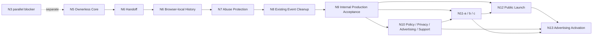

# N5–N9 Release-Line Closeout Guide

> Status: `GUIDANCE REPORT / NON-CANONICAL / GIT-MANAGED LIVING REFERENCE / NOT PERMISSION-GRANTING`
>
> Primary owner: PKA
> Initial date: 2026-08-03 JST

## 簡易summary

| 観点 | 現在の整理 |
|---|---|
| いまどこか | N7 final candidateはpublish済みで、final Hosted QAとfixture cleanupは完了し、closeout recordsを準備した。N7 final Head reviewとHuman acceptanceは未完了である。 |
| 固定済み | N5→N6→N7の直列release ancestry、N5／N6のaccepted Head、N7の採用済みContract／Plan／Architecture／Class M Packet、N7 closeout-scope CA correction、N8／N9／N12／N13のRoadmap上の責務。 |
| 次に何をするか | final N7 Head reviewとHuman acceptanceを行う。 |
| 今しないこと | N8開始、main integration、PR Ready化、Production操作、credentialまたはFirewall mutationを開始しない。 |
| N7はいつcloseするか | final N7 HeadのHuman acceptanceとstacked PRのReady化後。ただしmainへは統合しない。 |
| N5〜N9はいつcloseするか | N5〜N9のaccepted release lineがN9 internal Production acceptanceとfinal release Headに到達し、別Human main-integration gateを通ったとき。 |
| public launchはいつか | N12 Public LaunchのHuman gate後。N7 closeおよびN9 closeと同義ではない。 |

## 2026-08-04 N7 closeout status update

このupdateは、current N7 branch statusを記録する。§5の2026-08-03 snapshotはinitial planning historyとして保持し、current statusにはこのupdateと[closeout lifecycle addendum](n7-closeout-lifecycle-addendum-2026-08-04.md)を優先する。N5〜N9のstacked release topology、N8／N9のscope、main-integration gate、N12 public-launch gateは変更しない。

- final implementation Head: `93f75d1673bd97a017fd62be6cb9314360bdb208`
- N7 Hosted QA: PASS。`61` POST、`60` HTTP 201、`1` HTTP 429、retry `0`。
- fixture cleanup: COMPLETE。ROLLBACK PASS、COMMIT `1`、final QA DB eight business tables `0`。
- CA correction: `N7_HOSTED_QA_DISCOVERED_FOCUSED_RUNTIME_CORRECTION`としてHumanがcloseout scopeへ採用。Plan本文は変更しない。
- final technical evidence: [technical result](n7-hosted-qa-technical-result-2026-08-04.md)を参照する。process nonconformanceは[process review](n7-execution-process-review-2026-08-04.md)へ分離する。
- next action: final N7 Head review and Human acceptance。N7 slice close、stacked PR Ready、main integration、N8およびProductionは未完了であり、別Human decisionを必要とする。

## 1. このreportの使い方

このreportは、N5〜N9 release lineの現在地、固定済みの依存関係、次のHuman判断および再計画が必要な境界を短時間で確認するための道しるべである。正本ではなく、Human decisionを代行せず、authorityまたはpermissionを生成しない。

意味の競合時は、次の順で優先する。

1. 新しい明示的なHuman decision
2. [Current Roadmap](development-and-business-activity-plan-2026-07-17.md)、採用済みContract、Plan、Operation Packetおよび各仕様正本
3. このreport

accepted factは再構築せず、branch、HEAD、remote、deployment、credential、Firewall、QA DBのようなdrift-sensitive factだけを必要なphaseでfresh確認する。本文の更新候補はPKAが作成し、更新責任もPKAが持つ。

## 2. Governing Roadmap and authority map

上位入力は[Current Roadmap](development-and-business-activity-plan-2026-07-17.md)である。ContractとPlanのcurrent lifecycleは[Contract lifecycle index](../contracts/README.md)で確認する。repository全体のKnowledge入口は[docs/README.md](../README.md)、共通遂行境界は[AGENTS.md](../../AGENTS.md)および[CLAUDE.md](../../CLAUDE.md)である。

### Source map

| input | このreportでの用途 | 優先するsource |
|---|---|---|
| repository governance | 正本性、role、permission、reports indexの規約 | [AGENTS.md](../../AGENTS.md)、[CLAUDE.md](../../CLAUDE.md)、[docs/README.md](../README.md)、[reports index](README.md) |
| N5 accepted state | accepted Head、Layer 2／H5、QA／credential／cleanupのaccepted historical fact | [Contract lifecycle index](../contracts/README.md)、[requirements](../03_requirements.md)、[QA flow](../06_qa-flow.md) |
| N6 Handoff | accepted Head、docs-only entry boundary、stacked ancestry | [N6 Handoff](../contracts/n6-handoff-and-entry.md)、[Contract lifecycle index](../contracts/README.md) |
| N6 Implementation | accepted Head、N7 base、browser-history boundary | [N6 Contract](../contracts/WTV-N6-BROWSER-HISTORY-IMPLEMENTATION-CONTRACT-v0.4-draft.md)、[N6 Plan](../plan/WTV-N6-BROWSER-HISTORY-IMPLEMENTATION-PLAN-v0.1-draft.md)、[Contract lifecycle index](../contracts/README.md) |
| N7 | adopted Handoff／Execution Contract／Plan／Architecture／Class M Packet、candidate state、next gate | [Contract lifecycle index](../contracts/README.md)、[N7 Handoff](../contracts/WTV-N7-EVENT-CREATION-ABUSE-PROTECTION-HANDOFF-AND-ENTRY-CONTRACT-v0.3-draft.md)、[N7 Plan](../plan/WTV-N7-EVENT-CREATION-ABUSE-PROTECTION-IMPLEMENTATION-PLAN-v0.1-draft.md)、[Class M Packet](../operations/WTV-N7-EVENT-CREATION-ABUSE-PROTECTION-CLASS-M-OPERATION-PACKET-v0.1-draft.md) |
| downstream | N8／N9／N10／N11／N12／N13、N3 parallel blocker、main-integration／public-opening boundary | [Current Roadmap](development-and-business-activity-plan-2026-07-17.md) |

- N5〜N7は一つのstacked release lineであり、N7のbaseはN6 Implementation accepted Head、N8のbaseはfinal N7 accepted Headである。
- N9はN5〜N9 release lineのinternal Production acceptanceを担う。main integrationはN9の別Human gateであり、N5〜N7の個別mergeではない。
- N12だけがpublic-launch gateである。N13はpost-launchのAdvertising Activationであり、N12のblockerではない。
- N3はparallel blockerであり、N5〜N9のstackを個別のN3実行許可へ読み替えない。

## 3. Accepted facts that must not be reopened

| slice | accepted Head | branch／PR | lifecycleとdownstream role | 再オープンしないこと | main integration |
|---|---|---|---|---|---|
| N5 | `022b85776109bae62ef21380539523bafc3e147b` | `codex/n5-ownerless-transition`／PR #39 | Layer 2 complete・H5 accepted。N6以降のrelease ancestryの親。 | N7 WAF、N8 cleanup、N9 release作業をN5 branchへ追加しない。 | 未完了 |
| N6 Handoff | `af0a6f8693dd6ec6f45e03e13319751caa7deb67` | `codex/n6-handoff-and-entry`／PR #40 | 採用済みhandoff。N6 Implementationのprovenance。 | Handoffの機能・security・QA境界をN7理由で書き換えない。 | 未完了 |
| N6 Implementation | `cfdc5178f73c34a535f16054dbedd6f53e722869` | `codex/n6-browser-history`／PR #41 | 採用済みN6 implementation Head。N7 candidateの親。 | browser historyのstorage、privacy、failure semanticsをN7の429処理で変更しない。 | 未完了 |

N5およびN6 branchには追加commitをしない。N6 accepted Headに入っていないlifecycle同期またはN7成果物は、N6へ戻さずN7 cumulative candidateに含める。accepted Headを変える、branchをretargetする、またはrelease topologyを変える場合は、このreportではなく別Human rebaselineを必要とする。

## 4. 三つのcloseの定義

| close | 完了境界 | 完了していないこと |
|---|---|---|
| N7 slice close | final N7 HeadをHumanがacceptし、N7 stacked PRがReadyとなる。 | main integration、N8／N9、public launch。 |
| N5–N9 release-line close | N5〜N9のaccepted lineがN9 internal Production acceptanceとfinal release Headに到達し、別Human main-integration gateを通る。 | N12 public opening、N13広告activation。 |
| Public launch close | N12 Public Launchのordered Human gateを完了し、Vercel Authenticationを解除してpublic openingを宣言する。 | N13 Advertising Activation。 |

N7 Preview evidenceまたはPreview Firewall ruleのretainは、Production WAF、main merge、N9完了またはpublic-launch readinessの証明ではない。

## 5. 2026-08-03 Initial N7 Snapshot (Historical)

以下は`As of 2026-08-03 JST`のrepository／local Git確認に基づくsnapshotである。外部状態はfresh確認が必要であり、未確認をPASSとして扱わない。

| 項目 | snapshot | 確認扱い |
|---|---|---|
| local branch／base HEAD | `codex/n7-event-creation-abuse-protection`／`cfdc5178f73c34a535f16054dbedd6f53e722869`。N6 Implementation accepted Headと同一。 | local Gitで確認済み |
| remote N7 branch | local remote-tracking refには存在しない。fresh actual remote absenceの証明ではない。 | Phase 2でfresh確認 |
| N7 candidate Head | なし。N7差分を含むcommitはまだない。 | local Gitで確認済み |
| dirty／untracked candidate | 作成時点の既存candidateは12 paths。追跡済み変更7件とuntracked N7 artifact 5件であり、ownerを変更しない。 | candidate freezeでexact manifestを再確認 |
| implementation 2 paths | `src/components/CreateEventForm.tsx`、`tests/slice-1.spec.ts`。429はresponse body parse前に専用表示へ分類し、history記録・retry・navigationを行わないcandidateである。 | C1 typecheck／build／focused testsおよびfocused implementation reviewはPASS。Hosted挙動は未証明 |
| adopted N7 authority | Handoff v0.3 `3b5c3de4…b166`、Execution Contract v0.4 `e694757d…3d5e`、Implementation Plan v0.1 `9f531f40…64d2`、Vercel-aligned Architecture、Class M Packet v0.1 `93d2252a…bf18`。詳細identityは[Contract lifecycle index](../contracts/README.md)を正とする。 | accepted input。実行permissionは0 |
| active Firewall configuration identity | exact rule／version／active semanticsはこのreportで再確認していない。 | Class R以降でfresh確認 |
| REST mutationがactiveへ直接反映した実測 | このreportのsourceからは未確認。 | Class Mのqualified operationで確認対象 |
| QA DB PF-1〜PF-6 | N7用のfresh postflight／business-row baselineは未確認。 | Hosted QA前後にfresh確認 |
| QA DB business rows | N5 Layer 2 cleanup後のbusiness rows 0はaccepted historical fact。N7 QA開始時のbaselineを代替しない。 | N7 preflightでfresh確認 |
| Event creator credential | N5で`PRESENT / VERIFIED`だったaccepted QA proof。N7でのcredential有効性、target、利用は未確認・未許可。値は記録しない。 | 別Human gateとfresh preflight |
| N7 branch-specific Vercel variables | N5のbranch-specific QA bindingはhistorical fact。N7 branchへの4 variables bindingは未実施。 | Phase 3の別Human gate |
| N7 Preview deployment | qualified Previewは未作成。N5のdeploymentをN7証拠へ流用しない。 | Phase 3でdeployment correlation |
| Hosted QA／fixture cleanup | N7では未実施。N5のcleanup completeをN7 cleanup completeと読まない。 | Phase 4／5の別Human gate |
| Git publication | N7 candidate commit、remote publication、PR作成または更新は未実施。 | Phase 2の別Human gate |

### Candidate manifest impact

作成時点で確認した既存candidate manifestは次の12 pathsである。

1. `docs/03_requirements.md`
2. `docs/06_qa-flow.md`
3. `docs/README.md`
4. `docs/contracts/README.md`
5. `docs/contracts/WTV-N7-EVENT-CREATION-ABUSE-PROTECTION-EXECUTION-CONTRACT-v0.3-draft.md`
6. `docs/contracts/WTV-N7-EVENT-CREATION-ABUSE-PROTECTION-EXECUTION-CONTRACT-v0.4-draft.md`
7. `docs/contracts/WTV-N7-EVENT-CREATION-ABUSE-PROTECTION-HANDOFF-AND-ENTRY-CONTRACT-v0.3-draft.md`
8. `docs/operations/WTV-N7-EVENT-CREATION-ABUSE-PROTECTION-CLASS-M-OPERATION-PACKET-v0.1-draft.md`
9. `docs/plan/WTV-N7-EVENT-CREATION-ABUSE-PROTECTION-IMPLEMENTATION-PLAN-v0.1-draft.md`
10. `docs/reports/development-and-business-activity-plan-2026-07-17.md`
11. `src/components/CreateEventForm.tsx`
12. `tests/slice-1.spec.ts`

本guideとreports indexを加えたcandidate freezeのexpected manifestは14 pathsとなる。ただし、freeze packetは直前に実際の差分を再確認し、12 paths自体に増減があれば推測で14と確定しない。

## 6. Fixed N7 execution plan

以下は既存authorityを接続する固定順序であり、いずれのphaseも次phaseのpermissionを生成しない。

| phase | goal | required output／exit | 固定境界 |
|---|---|---|---|
| 1. Release-line continuity and N7 candidate freeze | N5／N6 accepted Headsを変更せずN7成果物を一意なcandidate manifestに固定する。 | exact manifest、artifact identity、fresh validation、parent Head、commit boundary、publication packet candidate。 | N5／N6を再オープンしない。 |
| 2. N7 candidate commit and remote publication | `cfdc517…`をparentにN7差分を含む新candidate Headを作り、normal non-force pushでremote N7 branchを作る。 | N7 candidate Headとremote correlation。 | `cfdc517…`自体をN7 Headとしてpushしない。N5／N6／main、PR #39／#40／#41を変更しない。force push 0。 |
| 3. Branch-specific QA binding and qualified Preview | exact N7 branchにQA用4 variablesをPreview限定でbindし、exact candidate Headのqualified Previewを作る。 | target、branch、commit、deploymentのcorrelation。 | secret入力はHuman、metadata／deployment確認はDevOps。bootstrap Previewとqualified Previewを混同しない。 |
| 4. Hosted QA | qualified Previewとcurrent active Preview Firewall ruleでOption Aを検証する。 | POST最大61、accepted最大60、rejected最大1、retry 0、Event 60、default Criterion 60、mismatch 0、61件目delta 0、client 429、Production request 0。結果はregion-scoped。 | 共有QA／Preview resourceへの競合operationをこのphase中は停止する。 |
| 5. Fixture cleanup and Firewall disposition | N7 fixtureだけをexact execution IDでcleanupし、active Preview Firewall ruleの状態を記録する。 | fixture target 0、unrelated rows 0、rollback validation、COMMIT 1、retry 0。 | N5 cleanupを再実行しない。active ruleはfinal Human Retain／Remove dispositionまで暫定維持中とする。RetainならM3／M4は`0`、Removeなら別Human gateでM3／M4を扱う。 |
| 6. N7 closeout, final review and stacked PR | Hosted実測とprovider lifecycle知見をcloseoutへ反映し、final N7 Headを固定する。 | focused／Independent review、Human acceptance、N7 stacked PR Ready。 | PR headは`codex/n7-event-creation-abuse-protection`、baseは`codex/n6-browser-history`。main mergeを行わない。 |

## 7. N8／N9 handoff

- N8はfinal N7 accepted Headをbaseにする。既存scopeは、Vercel Authenticationを維持したmaintenance状態でのProduction旧Event／owner dataのfresh discovery、Human承認済みexact scopeのcleanup、postcheck、N9 handoff準備である。
- N8はmigration、application deployment、Data API再開、WAF変更、Production smokeを担わない。N7のPreview WAFまたはHosted QAをProduction WAFへ自動導出しない。
- N5 Layer 2 QA資産は、N7 Hosted QAおよびN7 fixture cleanupが完了する前にretireしない。retirement時期とexact identityはN8の既存gateで扱う。
- N9はN5〜N9 release lineのinternal Production acceptanceを担う。final release Headとmain integrationは別Human gateであり、N7のPR Ready化から導出しない。

## 8. N12まで／N13以降のDB operation policy

| 区分 | 位置づけ | 意味 |
|---|---|---|
| current canonical policy | [AGENTS.md](../../AGENTS.md)およびCurrent Roadmap | Production Supabase write、migration、cleanup COMMITはHuman-only。QA／Previewを含む各operationも個別authorizationの範囲を越えない。 |
| Human operational direction | このreport作成時のHuman direction | N12完了までは、個別Human authorizationの範囲内でCodex／DevOpsがQA／Preview DBを実行し得る。credential生成・保管・revoke、Production境界、例外判断はHuman責任。 |
| future amendment required | N8／N9のProduction DB write | 実行前にtracked governanceへ期間限定amendmentを置き、Humanが別途承認する。このreport自体はamendmentでもpermissionでもない。 |
| N13以降 | Human operational direction | N13以降のProduction DBに対するCodex権限は原則Read Onlyへ戻す。実際の移行はN13の後続decisionとtracked amendmentで確認する。 |

## 9. Anti-ad-hoc operating rules

### Accepted fact reuse

- accepted factをread不足だけで再作成、再migration、再provisioning、削除して再作成しない。
- drift-sensitive factだけをfresh確認する。N5 QA project、Event creator role／credential、N6 implementation、N7 Contract／Plan／Packet、active ruleを通常工程として作り直さない。

### Phase-local autonomy

Primary operatorは、futureのexact Human authorizationが定めるGoal、scope、permission、数値上限、STOP条件の内側でだけ、bounded read-only diagnosisまたはdocumented variantを選べる。局所的なread failureだけでRoadmap全体を場当たり的に組み替えない。

### Human return conditions

次の場合だけHumanへ戻る。

- write／mutation追加、scope変更、Production影響、credential生成またはrotation
- accepted Head、branch／PR topology、cleanupまたはdestructive operationの変更
- product／architecture、phase exit条件の変更
- target ambiguity、credential safety mismatch、outcome unknown、bound excess、Preview／Production isolation未証明

### Single-writer model and no implicit permission

- report本文とreports indexのwriterはPKA一名だけとする。subagentはread-only findingを返し、PKAが採否とfinal identityに責任を持つ。同一artifactへのparallel writeは0件とする。
- phase PASSから次phase permissionを、review PASSからadoptionを、adoptionからexecutionを、read PASSからmutationを導出しない。

## 10. Human decision map

| 判断 | 主な入力 | 出力 | 含まないpermission |
|---|---|---|---|
| 1. N7 candidate freeze／publication | exact manifest、parent Head、validation | candidate commit／normal pushの可否 | Preview binding、Hosted QA、cleanup、main merge |
| 2. QA branch binding／qualified Preview | target identity、credential safety、N7 candidate Head | Preview-only QA bindingとqualified deploymentの可否 | Firewall mutation、Hosted QA、Production |
| 3. Hosted QA | Class R、M1／M2 result、qualified Preview、bounds | Option A Hosted QAの可否 | cleanup、Retain／Remove、Production |
| 4. fixture cleanup／Firewall disposition | execution ID、postflight、fixture scope、rule result | cleanupとRetain／Removeの可否 | main merge、Production WAF |
| 5. final N7 acceptance／stacked PR | final Head、reviews、known limitations | N7 slice closeとPR Readyの可否 | main integration、N8開始、Production |
| 6. N8 start | final N7 accepted Head、N8 entry evidence | N8 task開始の可否 | N9／N12 public opening |
| 7. N9 internal Production／main integration | N8 handoff、final release Head、runbook | internal Production acceptanceおよび別main-integration gate | public launch、N13 |
| 8. N12 public launch | N9／N11 acceptance、public-opening preflight | Vercel Authentication解除とlaunch declaration | N13 ad activation |
| 9. N13 Production DB Read Only transition | N13 completion、tracked amendment | future Production DB access postureの確認 | 過去gateの遡及的なpermission |

## 11. Immediate next action

Current next objectiveは**final N7 Head review and Human acceptance**である。

review packetは次を一意に確認する。

- N5／N6 accepted Headsを不変に保つfinal N7 Head。
- final Hosted QA technical result、execution／cleanup evidence identity、region-scoped limitation。
- technical PASSと分離したprocess review。
- `N7_HOSTED_QA_DISCOVERED_FOCUSED_RUNTIME_CORRECTION`のHuman scope classificationと、Plan本文不変更の境界。
- N7 slice close、stacked PR Ready、main integration、N8、credential／Firewall final dispositionおよびProductionがまだ別判断であること。

このnext actionはGit publication、PR Ready化、main merge、N8開始、credential／Firewall mutationまたはProduction operationを許可しない。

## 12. Update policy and change log

PKAが更新候補を作るtriggerは、phase exit、accepted Head変更、release topology変更、Humanによるplan変更、blockerがphase goal／exitを変更した場合、N8／N9／N12へのhandoff、DB operation policy amendment、N13 Read Only transitionである。

次だけでは更新しない。

- 一時的なread retryまたは解消済みparser error
- phase planを変えない同一phase内の軽微なdiagnostic
- evidence fileの追加だけ
- phase exitを変えないSTOP

| date | changed section | trigger | Human decision／authority source | meaning delta | next action |
|---|---|---|---|---|---|
| 2026-08-03 JST | Initial report | `N5_N9_RELEASE_LINE_CLOSEOUT_GUIDE_CREATION_AUTHORIZATION` | Human `AUTHORIZE` | N5〜N9の既存authorityを再設計せずnavigationを追加。 | `N7_RELEASE_LINE_CANDIDATE_FREEZE_READY` |
| 2026-08-04 JST | 簡易summary、N7 closeout status update | `N7_CLOSEOUT_RECORD_AND_ACCEPTANCE_PREPARATION` | Human `RESUME`、final evidenceとCA closeout-scope correction | N7 candidate publication、Hosted QA、fixture cleanupの完了を記録し、final Head reviewをnext actionへ更新。release topologyと下流scopeは不変。 | final N7 Head review and Human acceptance |
